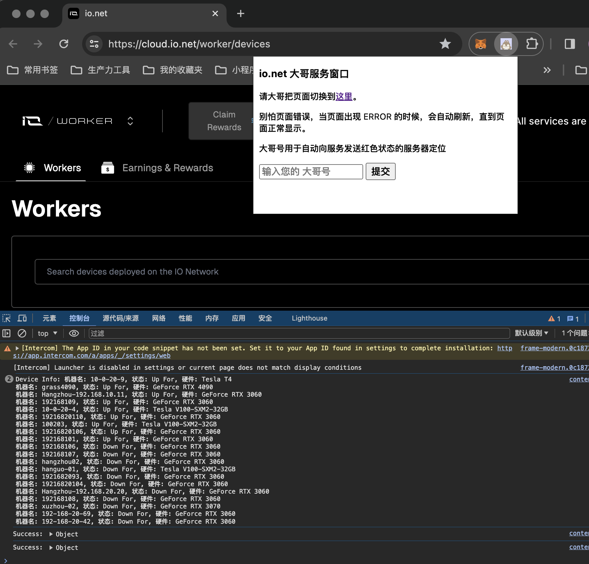

# 大哥们的 ionet 挂机监控

这是专门给我大哥们安排的一个监控 io.net上机器是否挂了的简单后端。

## 前端
前端是一个 chrome 的插件，把所有机器状态都抛到后端，方便批量运维。



前端预计今明两天开源，再让我稍微整理一下。

## docker 构建与部署

构建
```bash

docker build -t dageio .
```

运行下面的命令，就可以启动一个容器，监听 8000 端口。
```bash
docker run -d --name dageio -p 8000:8000 dageio
```

## nginx 配置

```nginx
location /ionet {
    proxy_pass http://127.0.0.1:8000;
    proxy_set_header Host $host;
    proxy_set_header X-Real-IP $remote_addr;
    proxy_set_header X-Forwarded-For $proxy_add_x_forwarded_for;
}
```

## 希望大哥们喜欢。
